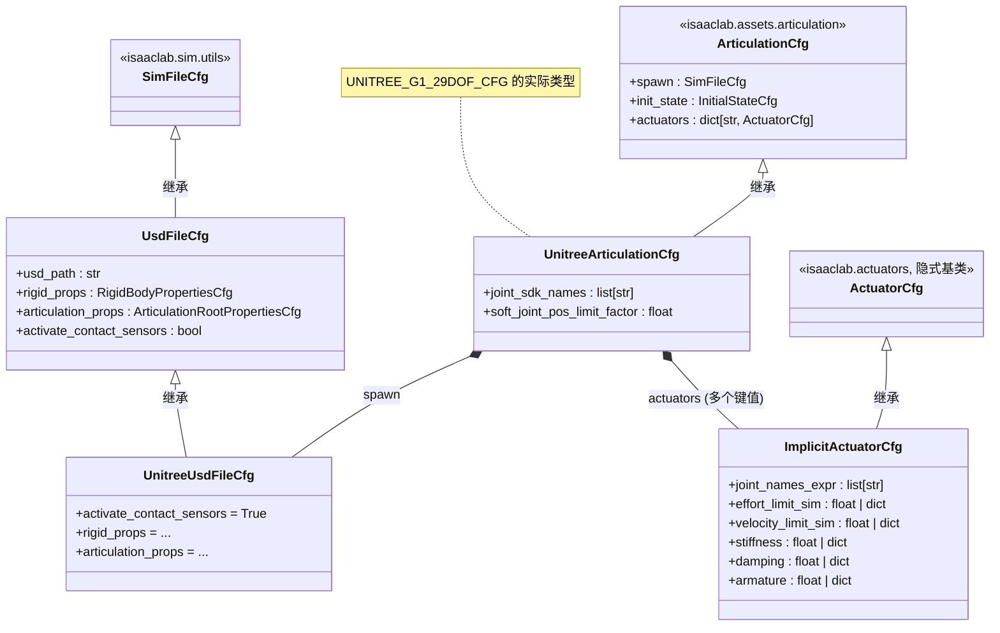

针对 `UNITREE_G1_29DOF_CFG` 这个配置对象，其核心的**继承关系与组合结构**如下图所示（UML 类图）：

**图中关键关系解释：**

1. **继承链**

   - `UnitreeArticulationCfg` 继承自 Isaac Lab 的 `ArticulationCfg`，额外添加了 `joint_sdk_names` 和 `soft_joint_pos_limit_factor` 两个字段。
   - `UnitreeUsdFileCfg` 继承自 `UsdFileCfg`（后者又继承自 `SimFileCfg`），在 `UNITREE_G1_29DOF_CFG` 中被用作 `spawn` 字段的值。
   - `ImplicitActuatorCfg` 继承自执行器配置基类 `ActuatorCfg`（来自 `isaaclab.actuators`），定义了电机的 PD 控制参数与限幅值。
2. **组合关系**

   - `UNITREE_G1_29DOF_CFG` 是一个 `UnitreeArticulationCfg` 实例，其 `spawn` 字段持有一个 `UnitreeUsdFileCfg` 实例（配置 USD 文件路径与物理属性）。
   - `actuators` 字段是一个字典，其值都是 `ImplicitActuatorCfg` 的实例（如 `"N7520‑14.3"`、`"N7520‑22.5"` 等），每个实例通过 `joint_names_expr` 指定了作用的关节组及对应的力矩/速度/刚度/阻尼/armature 参数。

因此，`UNITREE_G1_29DOF_CFG` 这张“配置蓝图”就是通过继承 `ArticulationCfg` 获得机器人基础结构，再通过组合 `UnitreeUsdFileCfg` 和多个 `ImplicitActuatorCfg` 来完整描述机器人的物理模型与控制接口。
